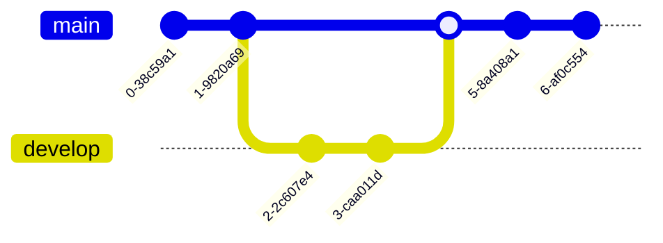

# 5.2 Visão de Desenvolvimento

 

A Visão de Desenvolvimento descreve como o sistema AcadMap está estruturado em termos de diretórios, pacotes e organização do código-fonte. O sistema é composto por dois grandes blocos tecnológicos:

* Backend monolítico com Java + Spring Boot
* Frontend com React + Vite

Ambas as partes são integradas via API REST e armazenam dados em um banco PostgreSQL, conforme representado na Visão Lógica.

## 5.2.1 Estrutura de Repositórios
O código e a documentação do sistema estão hospedados no GitHub:

1. [**Repositório de Desenvolvimento**](https://github.com/SainyGb/AcadMap-Docs)

2. [**Repositório de Documentação**](https://github.com/SainyGb/AcadMap-Docs)

Todos os repositórios seguem boas práticas de versionamento (`main`, `develop`), commits semânticos (conventional commits), e segue o Git Trunk Flow, com CI/CD configurado via GitHub Actions.

### Estratégia de Branches

- main: código estável e pronto para produção.
- dev: código em fase de integração e testes.
- feature/*: branches específicas para novas funcionalidades ou correções.

Exemplos de nomes de branchs:

- feature/cadastro-usuario
- bug/fix-header-mobile
- chore/atualiza-dependencias

Cada repositório possui:

- Arquivo `README.md` com instruções de uso e contribuição
- Pull Requests com revisão obrigatória

### Modelo de Estrutura de Arquivos
```
📁 .
├── 📁 backend
│   ├── 📄 Dockerfile
│   ├── 📁 src
│   │   └── 📁 main
│   │       ├── 📁 java
│   │       │   └── 📁 com
│   │       │       └── 📁 acadmap
│   │       │           ├── 📁 controller
│   │       │           ├── 📁 model
│   │       │           ├── 📁 repository
│   │       │           └── 📁 service
│   │       └── 📁 resources
│   └── 📁 tomcat
├── 📁 db
├── 📄 docker-compose.yml
├── 📄 .env
├── 📁 frontend
│   ├── 📄 Dockerfile
│   ├── 📁 public
│   └── 📁 src
│       ├── 📁 components
│       ├── 📁 pages
│       └── 📁 services
├── 📁 .github
│   └── 📁 workflows
│       └── 📄 ci.yml
└── 📄 README.md
```

A estrutura de diretórios do projeto AcadMap segue uma organização baseada em boas práticas de engenharia de software, com separação clara entre responsabilidades tanto no backend quanto no frontend.

### Backend (`backend/src/main/java/com/acadmap`)

No backend, implementado com Spring Boot, adota-se o padrão MVC (Model-View-Controller) organizado em quatro diretórios principais:

- **controller/**: contém as classes responsáveis por lidar com as requisições HTTP. Cada classe define os endpoints REST da aplicação, delegando a lógica de negócio para os serviços. Exemplo: `AutorController.java`, `ArtigoController.java`.

- **service/**: abriga as classes que implementam a lógica de negócio. Os serviços recebem chamadas dos controladores, processam regras, validam dados e orquestram chamadas aos repositórios. Exemplo: `AutorService.java`.

- **repository/**: inclui as interfaces responsáveis pelo acesso a dados, geralmente estendendo `JpaRepository` ou `CrudRepository`. Elas encapsulam a persistência e possibilitam operações como salvar, buscar e deletar entidades. Exemplo: `AutorRepository.java`.

- **model/**: define as classes que representam as entidades do domínio, mapeadas para as tabelas do banco de dados através de anotações JPA. Exemplo: `Autor.java`, `Artigo.java`.

Essa separação garante coesão, testabilidade e facilidade de manutenção no backend.

### Frontend (`frontend/src`)

No frontend, construído com React e Vite, o código é dividido de acordo com a função dos elementos dentro da interface e da lógica da aplicação:

- **pages/**: agrupa os componentes de alto nível que representam as páginas principais do sistema, geralmente associadas às **rotas da API**. Cada página é composta por uma combinação de componentes reutilizáveis. Exemplo: `DashboardPage.jsx`, `RelatoriosPage.jsx`.

- **components/**: reúne componentes visuais reutilizáveis, como botões, tabelas, formulários e cartões. Esses elementos são usados em múltiplas páginas para garantir consistência e modularidade na interface. Exemplo: `CardIndicador.jsx`, `TabelaArtigos.jsx`.

- **services/**: contém os módulos responsáveis pela comunicação com a API backend. Esses serviços encapsulam chamadas HTTP usando bibliotecas como `axios` ou `fetch`, centralizando a lógica de consumo da API. Exemplo: `autorService.js`, `artigoService.js`.

---

### 5.2.1.1 Workflow de Versionamento

Esta seção tem como objetivo ser um guia para o desenvolvedor. Nele, abordaremos os seguintes assuntos:

- Criar uma nova branch de trabalho
- Como enviar essa branch ao github
- Como resolver conflitos de merge

---

#### Clonando o repositório

O passo inical de todo fluxo de trabalho é fazer o clone do repositório, para isso, utilize o seguinte comando:

```
git clone https://github.com/acadmap-project/AcadMap.git
```

---

#### Criando a Branch

Com o repositório clonado, iniciaremos a criação de uma nova branch de funcionalidade. Para fins de exemplificação, chamarei de "feature/teste"

Sendo assim, todo o fluxo de trabalho sempre se iniciará a partir branch Dev, então vamos dar o mudar para ela:

```
git checkout dev
```

Estando na branch correta, temos de atualiza-la com as mudanças mais recentes antes de iniciar o nosso trabalho:

```
git pull
```

Com as atualizações feitas, podemos criar nossa branch nova baseada na dev:

```
git checkout -b feature/teste
```

Neste momento, na nova branch, podemos iniciar o desenvolvimento normalmente, fazendo as modificações necessárias para implementar a feature.

!!! note "Nota"
      Lembre-se de manter seu código organizado, estruturado e bem documentado.

---

##### Commitando suas modificações

Com a branch criada localmente e seu trabalho do dia completo, deve-se adicionar as mudanças feitas ao seu repositório local:

```
git add <nome-arquivo>
git commit -m 'feat: added new button'
```

---

#### Enviando suas mudanças ao Github

Com o fim do seu dia de trabalho e seu repositório local contendo as suas últimas mudanças feitas, é importante manda-las para o repositório remoto para mante-lo sempre atualizado:

```
git push origin feature/teste
```

---

#### Finalizando o ciclo de vida de uma branch de feature

Ao terminar o desenvolvimento da sua feature, você deve criar um Pull Request no Github, mas para isso, têm alguns passos que devem ser feitos antes:

1. Verificar e atualizar o conteúdo da branch dev.
2. Fazer o merge local.

   2.1 Resolver os conflitos localmente.

3. Criar o Pull Request
4. Encerrar as branch

---

##### Verificando e atualizando mudanças feitas na branch dev

Primeiro, nós atualizamos nossa branch dev local com as mudanças que ocorreram na dev remote.

Mudamos para a branch dev local:

```
git checkout dev
```

Atualizamos ela:

```
git pull origin dev
```

Verificamos a existência de divergências entre a nossa branch de feature e a branch dev atualizada:

```
git log feature/teste..dev --oneline
```

---

##### Fazendo o merge local

Caso existam diferenças, é necessário executar o merge da feature/teste <- dev localmente para garantir que nossa branch esteja atualizada.

Mudamos novamente para nossa branch de feature:

```
git checkout feature/teste
```

Fazemos o merge:

```
git merge dev
```

---

###### Resolvendo conflitos

Durante a execução do merge, podem surgir 2 tipos de conflitos diferente:

- Conflito por exclusão de arquivo
- Conflito por mudanças no mesmo conteúdo de um mesmo arquivo

Para garantir a continuação correta do fluxo, precisamos resolve-los para concluir o merge com sucesso.

---

###### Conflito por exclusão de arquivo

Esse tipo de conflito ocorre quando um arquivo foi excluído na branch dev, mas ainda está presente e possivelmente foi modificado na sua branch de feature.

O Git não sabe se deve manter o arquivo (por causa das suas alterações) ou excluí-lo (seguindo o que aconteceu na dev). Nesse caso, você precisa decidir manualmente o que deve ser feito.

Para visualizar os arquivos com conflito, utilize:

```
git status
```

Você verá uma mensagem similar a essa:

```
both deleted: nome-do-arquivo
```

A partir desse momento, existem dois caminhos a serem tomados:

- Aceitar a exclusão do arquivo
- Manter o arquivo

_Caso você escolha aceitar a exclusão do arquivo_:

```
git rm nome-do-arquivo
git commit
```

_Caso você julgue que o arquivo é importante e escolha manter o arquivo_:

```
git add nome-do-arquivo
git commit
```

---

###### Conflito por mudanças no mesmo conteúdo de um mesmo arquivo

Esse tipo de conflito acontece quando o mesmo trecho de um arquivo foi alterado tanto na branch dev quanto na sua branch de feature. O Git não consegue decidir automaticamente qual alteração manter, então você precisa resolver o conflito manualmente.

Ao executar o git merge dev, você verá mensagens de conflito como:

```
CONFLICT (content): Merge conflict in nome-do-arquivo.
```

rodando git status você verá:

```
both modified: nome-do-arquivo
```

Quando isso ocorrer, você dever abrir o arquivo o qual o conflito ocorreu utilizando seu editor de código de preferência.

Ao abrir o arquivo, você verá algo como:

```
<<<<<<< HEAD
// Esta é a versão da sua branch atual (feature/teste)
console.log('Mensagem da sua feature');
=======
 // Esta é a versão da branch dev
console.log('Mensagem da dev');
>>>>>>> dev

```

Note que o Git nos ajuda marcando o local que ocorreram as diferenças

Agora, você deve editar esse trecho para que o código final reflita o que realmente deve permanecer. Pode ser:

- A versão da sua feature
- A versão da dev
- Uma combinação das duas (mais comum)

Como exemplo:

```
console.log('Mensagem da dev com melhorias da feature');
```

!!! note "Nota"
      Depois de resolver todos os conflitos, remova os marcadores <<<<<<<, =======, >>>>>>>, salve o arquivo e faça o commit com as alterações concluídas:

      ```
      git add nome-do-arquivo
      git commit
      ```

!!! warning "Importante"
      Sempre converse com outros membros da sua equipe que trabalhou na dev, isso definitivamente ajudará a resolver os conflitos da melhor forma possível

Ao resolver os conflitos e realizar o merge com sucesso, você deve enviar essas alterações para seu repositório remoto:

```
git push origin feature/teste
```

---

##### Criando o Pull Request

Com as alterações enviadas a sua branch remota com sucesso, você pode criar o Pull Request pelo site do Github, no seguinte sentido:

    main <- feature/teste

Etapas para criar um Pull Request:

1. Acesse o repositório no GitHub
2. Verifique se a sua branch foi enviada corretamente
3. Clique em “Compare & pull request”
4. Preencha as informações do PR
5. Envie o Pull Request

Com o Pull Request criado, basta esperar a aprovação pelo líder do seu time.

!!! danger "Cuidado"
      Nunca faça o merge do seu próprio PR sem aprovação.

---

##### Encerrando a branch

Após o seu Pull Request ser aprovado e feito o merge na branch dev, você pode deletar sua branch de feature. Isso é importante para manter o repositório limpo e organizado, evitando o acúmulo de branches antigas e já integradas.

- Deletando branch remota:

  Caso o merge do seu Pull Request já tenha sido realizado no GitHub, você poderá deletar a branch remota acessando a aba "Pull Requests", clicando em "Closed" e selecionando o PR correspondente à sua branch. Na página do PR, haverá um botão "Delete branch", clique nele para remover a branch do repositório remoto.

- Deletando branch localmente:

  Para excluir a branch local (após ter certeza de que o trabalho foi integrado corretamente):

  ```
  git branch -d feature/teste

  ```

Dessa forma, concluimos o passo-a-passo do fluxo completo de trabalho no repositório de desenvolvimento!
Em casos de dúvidas quanto a gerência do repositório, contate o líder da sua equipe ou um Arquiteto!

---

## 5.2.2 Pipeline de CI/CD (RESUMO)


## 5.2.3 Gerência de Desenvolvimento e Tarefas

O projeto utiliza o recurso **GitHub Projects** para organização e acompanhamento das atividades de desenvolvimento, com os seguintes objetivos:

- Planejamento de entregas por sprint ou fase
- Priorização de funcionalidades e correções
- Acompanhamento do progresso por coluna (Kanban)
- Integração direta com Pull Requests e Issues

[Acesso o quadro aqui]()



---
